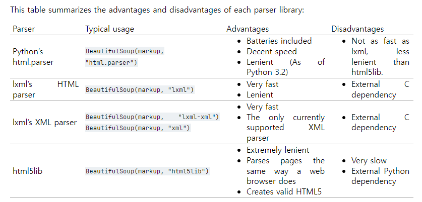

# Web Crawling

### 용어정리

- **웹(Web)**
  
  - 인터넷에 연결된 유저들이 정보를 공유할 수 있는 공간, world wide web (www) 
  
- **Web page**
  
  - 웹상에 HTML을 사용해 작성된 문서
  
- **HTML** (Hyper Text Markup Language)

  - 웹상의 정보를 구조적으로 표현하기 위한 언어 (이러한 구조정보를 tag라는 개념으로 표현)

  - ```html
    <태그> 내용 </태그> 		<!-- 왼쪽과 같이 작성 -->
    ```

- **HTTP** (Hyper Text Transfer Protocol)

  - 웹상에서 HTML 문서를 전송하기 위한 프로토콜 (FTP, SSH 등등 있음)

- **URL** (Uniform Resource Locator)

  - 정보가 위치하는 주소를 나타낸것
  - 웹 브라우저에 URL을 입력하면 해당 주소를 가진 서버에 접속해 필요한 정보를 요청 (IP address, DNS)
  - [더 자세한 내용](https://developer.mozilla.org/ko/docs/Learn/Common_questions/What_is_a_URL)

- **웹 크롤링** (Web Crawling)

  - 크롤링 : 웹페이지에서 문서를 긁어오는 과정
  - 스크래핑 : 가져온 문서에서 **원하는 정보**만 긁어오는 과정

- urllib.request : URL을 가져오기 위한 파이썬 모듈

- **requests** : 파이썬에서 서버에 HTTP요청을 보내 HTML문서를 가져올 때 사용하는 패키지

- **BeautifulSoup** : HTML 문서에서 원하는 내용만 가져오고 싶을때 사용하는 파이썬 패키지

- **파싱** (Parsing) : 특정 텍스트를 분석해 그 데이터로부터 필요한 정보를 추출하는 과정

  - BeautifulSoup parser 비교
    

  - lxml 사용할 예정

- **XML** (eXtensible Markup Language)
  - 태그를 사용해 데이터의 속성과 값을 표현하는 언어
  - <tag> 내용 </tag>
  - 사실상 HTML과 같은데 HTML은 웹에 필요하나 개념만 정의해서 사용, 그에비해 XML은 다양한 형태로 데이터 표현 가능
  - Class나 Object의 개념과 비슷하고 파이썬 딕셔너리로도 변경가능
  - (XML 스키마, DTD ?)
  - JSON과 비교하면 기능이 무겁기 때문에 최근에는 JSON을 많이 사용

- **JSON** (Javascript Object Notation)

  - javascript의 데이터 객체 표현방식을 사용하는 언어, 키-값 쌍으로 구성되어있음 
  - 간결해서 이해하기 쉬우며 XML보다 데이터 용량이 작고 코드로의 전환이 쉬워 대체재로 많이 활용됨
  - 파이썬 딕셔너리와 같게 이해하면 됨

- JSON과 XML

  - 데이터 구조가 둘 다 기본적으로 트리 구조

  - sibling : Anna Clayton, Alex Clayton을 저장하는 방식을 비교해보면
    JSON

    ```json
    {
        'sibling':[
            {'firstName':'Anna', 'lastName':'Clayton'},
            {'firstName':'Alex', 'lastName':'Clayton'}
        ]
    }
    ```

    XML

    ```xml
    <siblings>
        <sibling>
            <firstName>Anna</firstName>
            <lastName>Clayton</lastName>
        </sibling>
        <sibling>
            <firstName>Alex</firstName>
            <lastName>Clayton</lastName>
        </sibling>
    </siblings>
    ```

    


- API (Application Programming Interface)
  - 일종의 함수로, 해당 회사가 제공하는 서비스를 활용하기 위한 함수
  - API 주소를 사용해 얻고 싶은 정보를 요청하고 HTTP로 전송받을 수 있다
  - 자세한 건 API를 제공하는 회사의 API 문서를 읽어보자
  - ex) ...


(추가로 서버 - 클라이언트, 정적웹, 동적웹 등...)


#### 참고자료

데이터 과학을 위한 파이썬 프로그래밍, 챕터14~15
